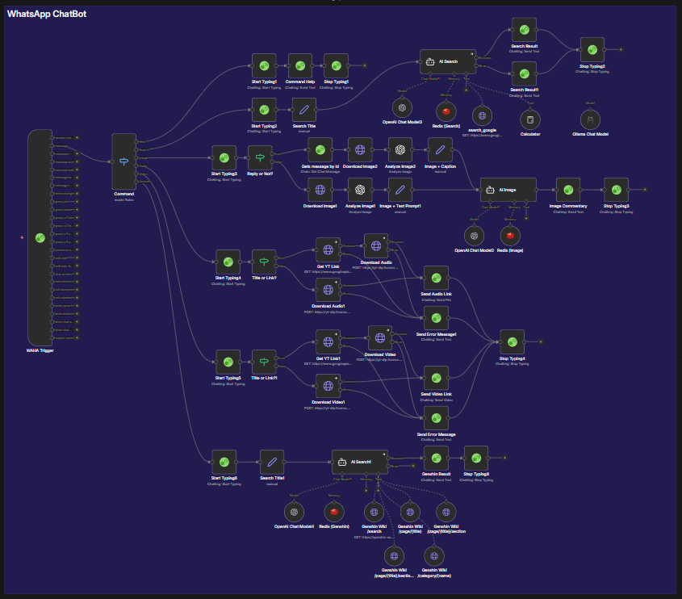

# WhatsApp Chatbot — KuyoBot 🤖💬

A command-driven WhatsApp AI chatbot built with **[WAHA](https://github.com/devlikeapro/waha)** and **[n8n](https://n8n.io/)** — capable of web search, image analysis, YouTube media downloads, and Genshin Impact knowledge lookups, all with per-user conversation memory.

---

## 🚀 Features

- **6 slash commands** for structured task handling
- **Dual LLM** — GPT-4o (cloud) + Qwen3:14B via Ollama (local)
- **Per-user Redis memory** — 24h session persistence, 10-message context window
- **Typing indicators** — realistic UX with start/stop typing signals
- **Reply-context awareness** — reads replied messages for full context
- **Error handling** — graceful error messages on failures

---

## 📜 Commands

| Command | Description |
|---------|-------------|
| `/help` | Show available commands |
| `/s <query>` | AI-powered web search via Google Search API |
| `/i <attach image>` | Analyze or comment on an image using GPT-4o |
| `/a <title or URL>` | Download and send audio (YT/TT/IG/FB/X) |
| `/v <title or URL>` | Download and send video (YT/TT/IG/FB/X) |
| `/genshin <query>` | Query the Genshin Impact knowledge base |

---

## 🧠 Tech Stack

| Component | Technology |
|-----------|------------|
| WhatsApp API | WAHA (WhatsApp HTTP API) |
| Workflow Automation | n8n |
| Image Analysis | OpenAI GPT-4o-latest |
| AI Chat (Search/Genshin) | OpenAI GPT-4o-mini |
| Local LLM | Ollama — Qwen3:14B |
| Conversation Memory | Redis (per-user, 24h TTL) |
| Web Search | Google Search API |
| Media Download | yt-dlp API (self-hosted) |
| Genshin Data | Genshin Wiki API (self-hosted) |

---

## ⚙️ How It Works

Every incoming WhatsApp message hits the **WAHA Trigger**, which passes it to a **Command Switch** node that routes by prefix:

### `/help`
Returns the list of available commands.

### `/s <query>`
Extracts the query → passes to an **AI Search agent** (GPT-4o-mini) equipped with a Google Custom Search tool. The agent fetches and scrapes the most relevant result, then replies with a summary and source URL. Per-user Redis memory keeps conversation context across follow-ups.

### `/i <image>`
Detects whether the user sent an image directly or replied to one:
- **Direct image** — downloads the attached image, analyzes it with GPT-4o-latest, then passes the description + user's caption to an **AI Image agent** for a response.
- **Reply to image** — fetches the original message, downloads that image, and includes both the image content and the reply caption as context.

Redis memory enables multi-turn image conversations.

### `/a <title or URL>` and `/v <title or URL>`
Checks whether the input is a direct URL or a search title:
- **Title** — searches YouTube Data API to find the best match, then passes the YouTube link to the self-hosted yt-dlp API.
- **Direct URL** — passes straight to the yt-dlp API (supports YT, TikTok, Instagram, Facebook, X).

The downloaded file is sent back via WAHA as an audio/video attachment with a direct download link in the caption. Errors return a graceful failure message.

### `/genshin <query>`
Passes the query to an **AI Genshin agent** (GPT-4o-mini) with access to 5 self-hosted Genshin Wiki tools: `/search`, `/page/{title}`, `/page/{title}/sections`, `/page/{title}/section/{index}`, and `/category/{name}`. The agent always fetches live wiki data before answering. Redis memory supports follow-up questions.

---

## 📦 Requirements

- [WAHA](https://github.com/devlikeapro/waha) — WhatsApp HTTP API
- [n8n](https://n8n.io/) — workflow automation (self-hosted)
- [Ollama](https://ollama.com/) — local LLM runtime (Qwen3:14B)
- Redis instance
- OpenAI API key
- Google Custom Search API key (for `/s` web search)
- YouTube Data API v3 key (for `/a` and `/v` title lookups)
- Genshin Wiki API (self-hosted) — see [genshin-wiki](https://github.com/fdhlulwafi/genshin-wiki)
- yt-dlp API (self-hosted) — see [yt-dlp](https://github.com/fdhlulwafi/yt-dlp)

---

## 🙏 Credits

- [WAHA](https://github.com/devlikeapro/waha) for WhatsApp integration
- [n8n](https://n8n.io/) for workflow automation
- [Ollama](https://ollama.com/) for local LLM hosting
- APIs: OpenAI, Google Search, YouTube, Genshin Wiki, yt-dlp
