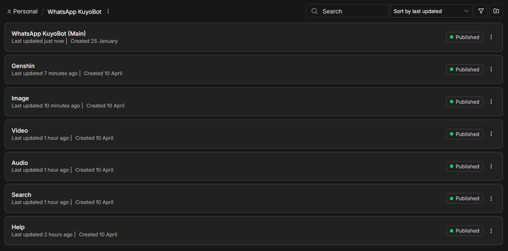
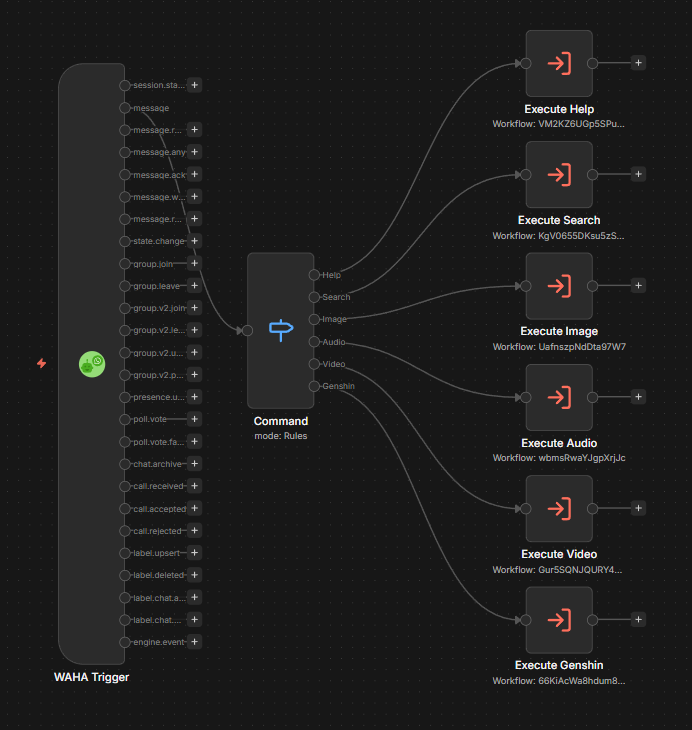
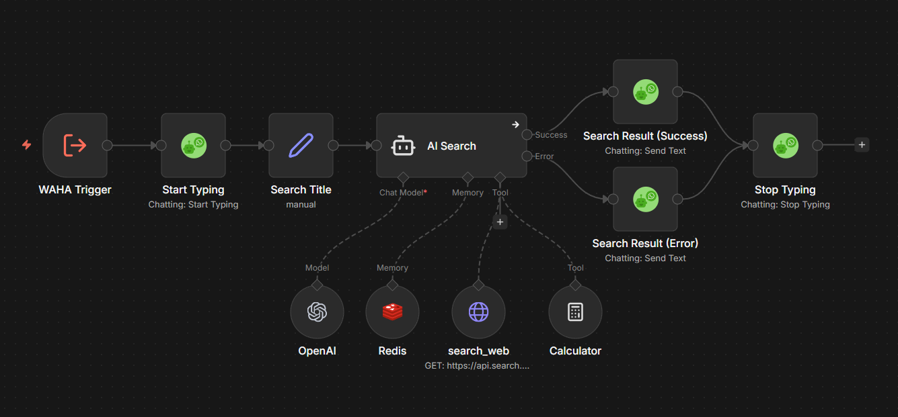
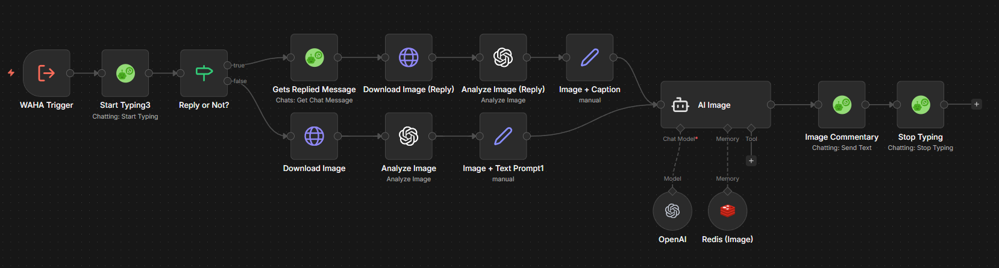
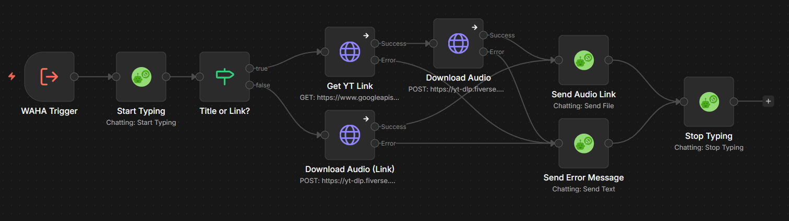
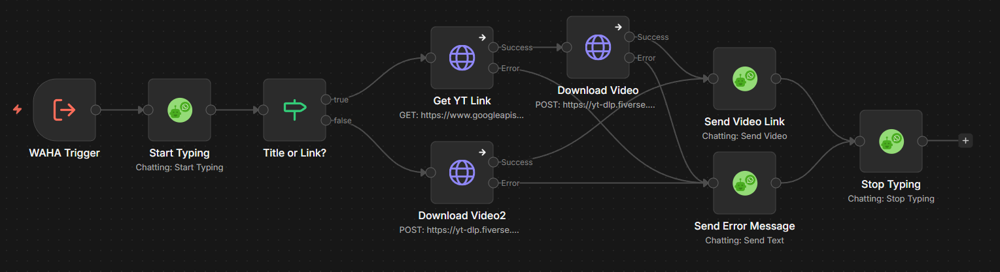
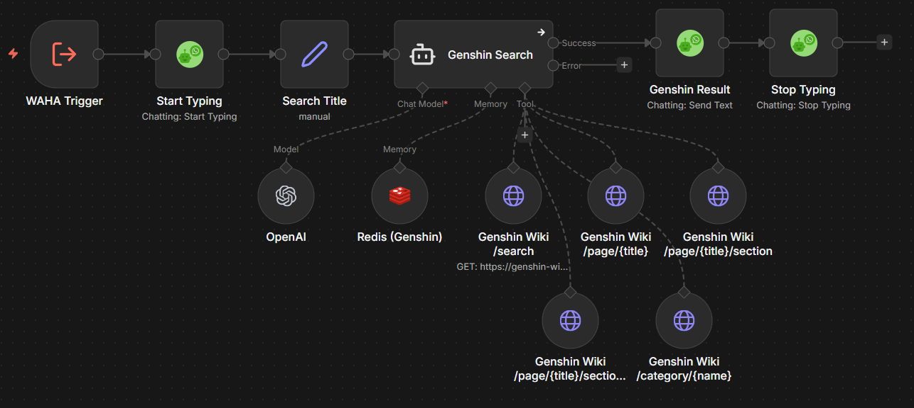

# WhatsApp KuyoBot

A WhatsApp chatbot built with [n8n](https://n8n.io) + [WAHA](https://waha.devlike.pro), organized as a main workflow that dispatches to 6 command sub-workflows.



---

## Commands

| Command | Description |
|---------|-------------|
| `/help` | Show available commands |
| `/s <query>` | Web search (Brave Search API + GPT-4o-mini) |
| `/i` | Analyze image — send with image or reply to one |
| `/v <title or URL>` | Download video (YT / TT / IG / FB / X) |
| `/a <title or URL>` | Download audio (YT / TT / IG / FB / X) |
| `/genshin <query>` | Fetch Genshin Impact wiki info |

---

## Architecture

```
WhatsApp Message
      │
      ▼
 WAHA Trigger
      │
      ▼
   Command (Switch)
      │
  ┌───┼───────┬──────────┬──────────┬──────────┐
  │   │       │          │          │          │
Help Search  Image     Audio     Video    Genshin
(sub) (sub)  (sub)    (sub)     (sub)     (sub)
```



### Search Sub-workflow
```
WAHA Trigger → Start Typing → Search Title → AI Search (agent)
  ├─ Tools: search_web (Brave API), Calculator
  ├─ Memory: Redis (TTL: 1h)
  └─ → Search Result (Success / Error) → Stop Typing
```



### Image Sub-workflow
```
WAHA Trigger → Start Typing → Reply or Not?
  TRUE  → Gets Replied Message → Download Image (Reply) → Analyze Image (Reply) → Image + Caption → AI Image
  FALSE → Download Image → Analyze Image → Image + Text Prompt → AI Image
  AI Image → Image Commentary → Stop Typing
  Memory: Redis (TTL: 1h)
```



### Audio Sub-workflow
```
WAHA Trigger → Start Typing → Title or Link?
  Title → Get YT Link (YouTube API) → Download Audio (yt-dlp) → Send Audio Link → Stop Typing
  Link  → Download Audio (yt-dlp) → Send Audio Link → Stop Typing
  (any error) → Send Error Message → Stop Typing
```



### Video Sub-workflow
```
WAHA Trigger → Start Typing → Title or Link?
  Title → Get YT Link (YouTube API) → Download Video (yt-dlp) → Send Video Link → Stop Typing
  Link  → Download Video (yt-dlp) → Send Video Link → Stop Typing
  (any error) → Send Error Message → Stop Typing
```



### Genshin Sub-workflow
```
WAHA Trigger → Start Typing → Search Title → AI Search1 (agent)
  Tools: /search, /page/{title}, /page/{title}/sections,
         /page/{title}/section/{index}, /category/{name}
  Memory: Redis (TTL: 24h)
  → Genshin Result → Stop Typing
```



---

## Workflows

| File | Workflow | Purpose |
|------|----------|---------|
| `workflows/main.json` | WhatsApp KuyoBot (Main) | WAHA trigger + command router |
| `workflows/help.json` | Help | Returns command list |
| `workflows/search.json` | Search | AI-powered web search |
| `workflows/image.json` | Image | Image analysis via GPT-4o-mini |
| `workflows/audio.json` | Audio | Audio download via yt-dlp |
| `workflows/video.json` | Video | Video download via yt-dlp |
| `workflows/genshin.json` | Genshin | Genshin wiki lookup |

---

## Tech Stack

| Layer | Tool |
|-------|------|
| Automation | [n8n](https://n8n.io) (self-hosted) |
| WhatsApp API | [WAHA](https://waha.devlike.pro) |
| AI Model | OpenAI GPT-4o-mini (search, image analysis, Genshin) |
| Web Search | [Brave Search API](https://brave.com/search/api/) (free tier: 2,000 req/month) |
| Session Memory | Redis (TTL: 1h for Search/Image, 24h for Genshin) |
| Media Download | [yt-dlp.fiverse.my](https://yt-dlp.fiverse.my) (self-hosted) |
| Genshin Data | [genshin-wiki-2.fiverse.my](https://genshin-wiki-2.fiverse.my) (self-hosted) |

---

## Import Guide

1. Clone this repo
2. Open your n8n instance → **Workflows** → **Import from file**
3. Import in this order (sub-workflows first):
   - `workflows/help.json`
   - `workflows/search.json`
   - `workflows/image.json`
   - `workflows/audio.json`
   - `workflows/video.json`
   - `workflows/genshin.json`
   - `workflows/main.json` — import last
4. Set up all credentials (see below)
5. Activate all 7 workflows
6. The main workflow automatically routes commands to the correct sub-workflow

> **Note:** After importing, the `Execute *` nodes in `main.json` reference sub-workflow IDs from the original instance. Update each Execute node to point to the newly imported sub-workflow IDs in your instance.

---

## Credentials Required

| Credential Name | Type | Used By |
|----------------|------|---------|
| `WAHA account` | WAHA API | All workflows |
| `OpenAi Fiverse` | OpenAI API | Search, Image, Genshin |
| `Brave Search API` | HTTP Header Auth (`X-Subscription-Token`) | Search |
| `YouTube Data API` | HTTP Query Auth | Audio, Video |
| `Redis account` | Redis | Search, Image, Genshin |

---

## Self-Hosted APIs

- **yt-dlp API** — `https://yt-dlp.fiverse.my` — handles `/a` and `/v` downloads
  - Source: [github.com/fdhlulwafi/yt-dlp](https://github.com/fdhlulwafi/yt-dlp)
- **Genshin Wiki API** — `https://genshin-wiki-2.fiverse.my` — serves Genshin Impact wiki data for `/genshin`
  - Source: [github.com/fdhlulwafi/genshin-wiki-2](https://github.com/fdhlulwafi/genshin-wiki-2)

---

## Notes

- Reply detection uses `payload.hasQuotedMsg === true` (not `payload._data.quotedMsg.type` which is unreliable)
- Redis memory can cause the LLM to pattern-match old behavior — flush with `docker exec <redis-container> redis-cli DEL "<chatId>"` to reset
- Search returns 1 result by default; users can ask for up to 3
