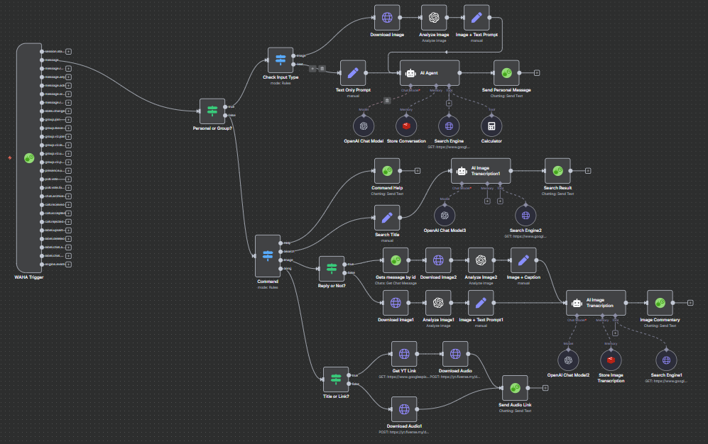

# WhatsApp Chatbot — KuyoBot 🤖💬

A command-driven WhatsApp AI chatbot built with **[WAHA](https://github.com/devlikeapro/waha)** and **[n8n](https://n8n.io/)** — capable of web search, image analysis, YouTube media downloads, and Genshin Impact knowledge lookups, all with per-user conversation memory.

---

## 🚀 Features

- **6 slash commands** for structured task handling
- **Dual LLM** — GPT-4o (cloud) + Qwen3:14B via Ollama (local)
- **Per-user Redis memory** — 24h session persistence, 10-message context window
- **Typing indicators** — realistic UX with start/stop typing signals
- **Reply-context awareness** — reads replied messages for full context
- **Error handling** — graceful error messages on failures

---

## 📜 Commands

| Command | Description |
|---------|-------------|
| `/help` | Show available commands |
| `/s <query>` | AI-powered web search via Google Search API |
| `/i <attach image>` | Analyze or comment on an image using GPT-4o |
| `/a <title or YT link>` | Download and send a YouTube audio track |
| `/v <title or YT link>` | Download and send a YouTube video |
| `/g <query>` | Query the Genshin Impact knowledge base |

---

## 🧠 Tech Stack

| Component | Technology |
|-----------|------------|
| WhatsApp API | WAHA (WhatsApp HTTP API) |
| Workflow Automation | n8n |
| Image Analysis | OpenAI GPT-4o-latest |
| AI Chat (Search/Genshin) | OpenAI GPT-4o-mini |
| Local LLM | Ollama — Qwen3:14B |
| Conversation Memory | Redis (per-user, 24h TTL) |
| Web Search | Google Search API |
| Genshin Data | Custom Genshin Wiki API |

---

## 📦 Requirements

- [WAHA](https://github.com/devlikeapro/waha) — WhatsApp HTTP API
- [n8n](https://n8n.io/) — workflow automation (self-hosted)
- [Ollama](https://ollama.com/) — local LLM runtime (Qwen3:14B)
- Redis instance
- OpenAI API key
- Google Search API key
- Genshin Wiki API (self-hosted) — see [genshin-wiki](https://github.com/fdhlulwafi/genshin-wiki)

---

## 🙏 Credits

- [WAHA](https://github.com/devlikeapro/waha) for WhatsApp integration
- [n8n](https://n8n.io/) for workflow automation
- [Ollama](https://ollama.com/) for local LLM hosting
- APIs: OpenAI, Google Search, YouTube, Genshin Wiki
